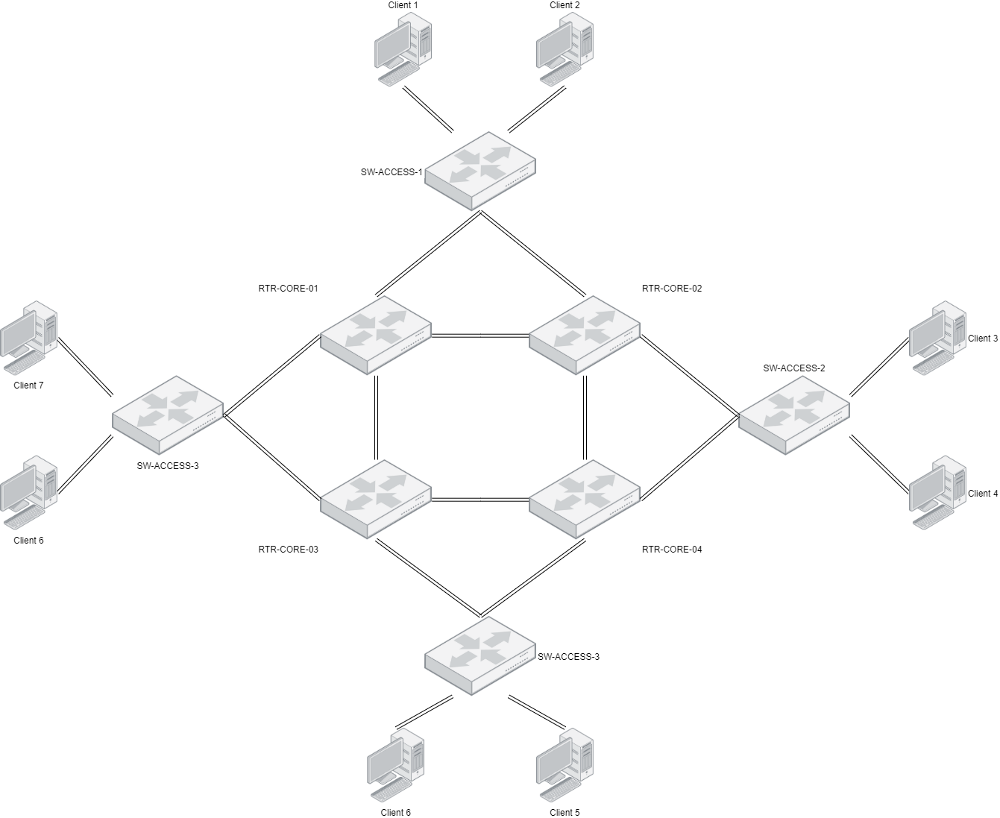

---
[![Project Version](https://img.shields.io/badge/Project_version-1.0.0-lightgrey?logo=data:image/png;base64,iVBORw0KGgoAAAANSUhEUgAAAA4AAAAOCAYAAAAfSC3RAAAAGXRFWHRTb2Z0d2FyZQBBZG9iZSBJbWFnZVJlYWR5ccllPAAAAyJpVFh0WE1MOmNvbS5hZG9iZS54bXAAAAAAADw/eHBhY2tldCBiZWdpbj0i77u/IiBpZD0iVzVNME1wQ2VoaUh6cmVTek5UY3prYzlkIj8+IDx4OnhtcG1ldGEgeG1sbnM6eD0iYWRvYmU6bnM6bWV0YS8iIHg6eG1wdGs9IkFkb2JlIFhNUCBDb3JlIDUuMy1jMDExIDY2LjE0NTY2MSwgMjAxMi8wMi8wNi0xNDo1NjoyNyAgICAgICAgIj4gPHJkZjpSREYgeG1sbnM6cmRmPSJodHRwOi8vd3d3LnczLm9yZy8xOTk5LzAyLzIyLXJkZi1zeW50YXgtbnMjIj4gPHJkZjpEZXNjcmlwdGlvbiByZGY6YWJvdXQ9IiIgeG1sbnM6eG1wPSJodHRwOi8vbnMuYWRvYmUuY29tL3hhcC8xLjAvIiB4bWxuczp4bXBNTT0iaHR0cDovL25zLmFkb2JlLmNvbS94YXAvMS4wL21tLyIgeG1sbnM6c3RSZWY9Imh0dHA6Ly9ucy5hZG9iZS5jb20veGFwLzEuMC9zVHlwZS9SZXNvdXJjZVJlZiMiIHhtcDpDcmVhdG9yVG9vbD0iQWRvYmUgUGhvdG9zaG9wIENTNiAoV2luZG93cykiIHhtcE1NOkluc3RhbmNlSUQ9InhtcC5paWQ6MkQzQ0Y2Mjg3QUIxMTFFQUFDMDJEQzA0MjdFMzQ3MkYiIHhtcE1NOkRvY3VtZW50SUQ9InhtcC5kaWQ6MkQzQ0Y2Mjk3QUIxMTFFQUFDMDJEQzA0MjdFMzQ3MkYiPiA8eG1wTU06RGVyaXZlZEZyb20gc3RSZWY6aW5zdGFuY2VJRD0ieG1wLmlpZDoyRDNDRjYyNjdBQjExMUVBQUMwMkRDMDQyN0UzNDcyRiIgc3RSZWY6ZG9jdW1lbnRJRD0ieG1wLmRpZDoyRDNDRjYyNzdBQjExMUVBQUMwMkRDMDQyN0UzNDcyRiIvPiA8L3JkZjpEZXNjcmlwdGlvbj4gPC9yZGY6UkRGPiA8L3g6eG1wbWV0YT4gPD94cGFja2V0IGVuZD0iciI/Puwy1SsAAAEfSURBVHjahNKxSgNBEMbx3IkQUGMnVhKNktoUFqIISpoUEkiVKp2VbyCIjQi22lhaKfgMYqdWokgIkgTxFcRYBHT9D3yn42HiwA/2dmeW3dmLQgiZVMRYxAIitHGHz19ZVuhUcY1++Akb36Lmc33RXvg/9tOFdS1c4AAveBAbH+JcOY2kcAJdTW5rozF3kmS8pRzbaNIasY45Xf5JV++5NiRja9IHZlC2wpIWnnGZGRxX6GhcssKsPkbU/kERKcciG7td8lgeUriE2e9jc9E8emiipfeads2Zwibaas47CsniMR71Traw4wp3U2955N9xHPc405sWXGHDFd0gZ/OxzvyGNbX7BBvubqOaP0UFr3/9q2YVRfc9j5V03pcAAwBVVJdvQk617QAAAABJRU5ErkJggg==&style=flat)](https://github.com/tchevalleraud/how-to-build-extreme-spb-network-fabric) [![VSP Version](https://img.shields.io/badge/vVOSS-8.1-blueviolet?logo=data:image/png;base64,iVBORw0KGgoAAAANSUhEUgAAAA4AAAAOCAYAAAAfSC3RAAAAGXRFWHRTb2Z0d2FyZQBBZG9iZSBJbWFnZVJlYWR5ccllPAAAAyJpVFh0WE1MOmNvbS5hZG9iZS54bXAAAAAAADw/eHBhY2tldCBiZWdpbj0i77u/IiBpZD0iVzVNME1wQ2VoaUh6cmVTek5UY3prYzlkIj8+IDx4OnhtcG1ldGEgeG1sbnM6eD0iYWRvYmU6bnM6bWV0YS8iIHg6eG1wdGs9IkFkb2JlIFhNUCBDb3JlIDUuMy1jMDExIDY2LjE0NTY2MSwgMjAxMi8wMi8wNi0xNDo1NjoyNyAgICAgICAgIj4gPHJkZjpSREYgeG1sbnM6cmRmPSJodHRwOi8vd3d3LnczLm9yZy8xOTk5LzAyLzIyLXJkZi1zeW50YXgtbnMjIj4gPHJkZjpEZXNjcmlwdGlvbiByZGY6YWJvdXQ9IiIgeG1sbnM6eG1wPSJodHRwOi8vbnMuYWRvYmUuY29tL3hhcC8xLjAvIiB4bWxuczp4bXBNTT0iaHR0cDovL25zLmFkb2JlLmNvbS94YXAvMS4wL21tLyIgeG1sbnM6c3RSZWY9Imh0dHA6Ly9ucy5hZG9iZS5jb20veGFwLzEuMC9zVHlwZS9SZXNvdXJjZVJlZiMiIHhtcDpDcmVhdG9yVG9vbD0iQWRvYmUgUGhvdG9zaG9wIENTNiAoV2luZG93cykiIHhtcE1NOkluc3RhbmNlSUQ9InhtcC5paWQ6ODM4Q0MyQTQ3QUIwMTFFQTg2REFFNEY5NEFGNDlBODIiIHhtcE1NOkRvY3VtZW50SUQ9InhtcC5kaWQ6ODM4Q0MyQTU3QUIwMTFFQTg2REFFNEY5NEFGNDlBODIiPiA8eG1wTU06RGVyaXZlZEZyb20gc3RSZWY6aW5zdGFuY2VJRD0ieG1wLmlpZDo4MzhDQzJBMjdBQjAxMUVBODZEQUU0Rjk0QUY0OUE4MiIgc3RSZWY6ZG9jdW1lbnRJRD0ieG1wLmRpZDo4MzhDQzJBMzdBQjAxMUVBODZEQUU0Rjk0QUY0OUE4MiIvPiA8L3JkZjpEZXNjcmlwdGlvbj4gPC9yZGY6UkRGPiA8L3g6eG1wbWV0YT4gPD94cGFja2V0IGVuZD0iciI/Pk5d9KkAAAC+SURBVHjaYvz//z8DGYCJEarRDYgrgJiQKYxA3A/ER1mgArJA7EikbauB+B1M4x8o/RWIZwPxLzw2ngIxWNAkPgBxITHWsmAxkQeIvwCxJpQNA9+B+Ao+jbAAWgDEZkhy14FYGybPBBWEKeZAUvgbzdDf2JwKM2Au1EkgEAvEXEhqf6BEFygegTgdiPuhbKIwLAGA3J4JdcF/AgkA5PcTyKYk/icOZIHUI4fqfCB+D8QJBGy8AWaQmcgZAAIMAPmGiMhVj17uAAAAAElFTkSuQmCC&style=flat)](https://github.com/extremenetworks/Virtual_VOSS) [![GNS3 Version](https://img.shields.io/badge/GNS3-2.2.5-blue?logo=data:image/png;base64,iVBORw0KGgoAAAANSUhEUgAAAA4AAAAOCAYAAAAfSC3RAAAAGXRFWHRTb2Z0d2FyZQBBZG9iZSBJbWFnZVJlYWR5ccllPAAAAyJpVFh0WE1MOmNvbS5hZG9iZS54bXAAAAAAADw/eHBhY2tldCBiZWdpbj0i77u/IiBpZD0iVzVNME1wQ2VoaUh6cmVTek5UY3prYzlkIj8+IDx4OnhtcG1ldGEgeG1sbnM6eD0iYWRvYmU6bnM6bWV0YS8iIHg6eG1wdGs9IkFkb2JlIFhNUCBDb3JlIDUuMy1jMDExIDY2LjE0NTY2MSwgMjAxMi8wMi8wNi0xNDo1NjoyNyAgICAgICAgIj4gPHJkZjpSREYgeG1sbnM6cmRmPSJodHRwOi8vd3d3LnczLm9yZy8xOTk5LzAyLzIyLXJkZi1zeW50YXgtbnMjIj4gPHJkZjpEZXNjcmlwdGlvbiByZGY6YWJvdXQ9IiIgeG1sbnM6eG1wPSJodHRwOi8vbnMuYWRvYmUuY29tL3hhcC8xLjAvIiB4bWxuczp4bXBNTT0iaHR0cDovL25zLmFkb2JlLmNvbS94YXAvMS4wL21tLyIgeG1sbnM6c3RSZWY9Imh0dHA6Ly9ucy5hZG9iZS5jb20veGFwLzEuMC9zVHlwZS9SZXNvdXJjZVJlZiMiIHhtcDpDcmVhdG9yVG9vbD0iQWRvYmUgUGhvdG9zaG9wIENTNiAoV2luZG93cykiIHhtcE1NOkluc3RhbmNlSUQ9InhtcC5paWQ6QzkyMDFFMDg3QUIwMTFFQTlDRkI5MUVFMDU5RjMyQ0YiIHhtcE1NOkRvY3VtZW50SUQ9InhtcC5kaWQ6QzkyMDFFMDk3QUIwMTFFQTlDRkI5MUVFMDU5RjMyQ0YiPiA8eG1wTU06RGVyaXZlZEZyb20gc3RSZWY6aW5zdGFuY2VJRD0ieG1wLmlpZDpDOTIwMUUwNjdBQjAxMUVBOUNGQjkxRUUwNTlGMzJDRiIgc3RSZWY6ZG9jdW1lbnRJRD0ieG1wLmRpZDpDOTIwMUUwNzdBQjAxMUVBOUNGQjkxRUUwNTlGMzJDRiIvPiA8L3JkZjpEZXNjcmlwdGlvbj4gPC9yZGY6UkRGPiA8L3g6eG1wbWV0YT4gPD94cGFja2V0IGVuZD0iciI/Pqk2Mi4AAAErSURBVHjafNLNK0RRGMfxY7pC2UoUOy/JbkLKS5RmYYqFrJRSspKysLSwQUkpL/8D22myIRaUmhVFBuUlw2I2NoqF63unnzxOubc+3Xqe53fPveceF4ah+0crLrGHlN93McHx8O+1gpq4YAfWkEEaw3hU+BB1fjDABr40NKNwFaZUK2DaD256rzaLJvVWTX0wqpWV0s5149T9Xh8IsI4K9OAV95iP+oEGJ0zoFk94Rx+68IICikgh+xNsMcFr1GMZlUjiSg96wHk0lNBwwgSHkEcDepHBhepz6LSBGxNc1EoHWEAO7fjUtw+UprRr/WbXRtGME4yZXU9iG5P+79hRsKhTM4I29WqxhGNU+8FybJmV89jHGd50b4w7ctGB3sUdnnGk0xLYuW8BBgBFhMQo22FM+gAAAABJRU5ErkJggg==&style=flat)](https://github.com/extremenetworks/Virtual_VOSS)

---

# About this repository

This repository aims to show you how to set up a SPB fabric solution from the manufacturer Extreme networks.

This guide will cover the following topics:
- Implementation of ISIS and SPBm
- Establishment of a level 2 service
- Implementation of routing

# Implementation of the fabric

## Topology overview

## Basic configuration

### VSP Configuration

| Name        | MGMT Ip         | Area      |   System ID    | SPBm Instance | Nick-Name      | B-VLAN     | Primary |
| :---------- | :-------------: | :-------: | :------------: | :-----------: | :------------: | :--------: | :-----: |
| RTR-CORE-01 | 192.168.0.201   | 49.0001   | 020c.0750.0001 | 1             | c.75.01        | 4051, 4052 | 4051    |
| RTR-CORE-02 | 192.168.0.202   | 49.0001   | 020c.0750.0002 | 1             | c.75.02        | 4051, 4052 | 4051    |
| RTR-CORE-03 | 192.168.0.203   | 49.0001   | 020c.0750.0003 | 1             | c.75.03        | 4051, 4052 | 4051    |
| RTR-CORE-04 | 192.168.0.204   | 49.0001   | 020c.0750.0004 | 1             | c.75.04        | 4051, 4052 | 4051    |
| SW-ACCESS-1 | 192.168.0.205   | 49.0001   | 020a.0750.0001 | 1             | a.75.01        | 4051, 4052 | 4051    |
| SW-ACCESS-2 | 192.168.0.206   | 49.0001   | 020a.0750.0002 | 1             | a.75.01        | 4051, 4052 | 4051    |
| SW-ACCESS-3 | 192.168.0.207   | 49.0001   | 020a.0750.0003 | 1             | a.75.01        | 4051, 4052 | 4051    |
| SW-ACCESS-4 | 192.168.0.208   | 49.0001   | 020a.0750.0004 | 1             | a.75.01        | 4051, 4052 | 4051    |

### Client configuration
| Client name | VLAN ID | IP Address |
| :---------- | :-----: | :--------: |
| Client 1    | 101     | 10.0.101.1 |
| Client 2    | 102     | 10.0.102.2 |
| Client 3    | 101     | 10.0.101.3 |
| Client 4    | 104     | 10.0.104.4 |
| Client 5    | 105     | 10.0.105.5 |
| Client 6    | 106     | 10.0.106.6 |
| Client 7    | 107     | 10.0.107.7 |
| Client 8    | 108     | 10.0.108.8 |

### Template configuration

Test

<pre style='color:#d1d1d1;background:#000000;'>
VSP-1100:1(config)# enable
VSP-1100:1(config)# configuration terminal
VSP-1100:1(config)# spbm
VSP-1100:1(config)# router isis
VSP-1100:1(config)# system-id $$_system_id_$$
VSP-1100:1(config)# manual-area $$_area_$$
VSP-1100:1(config)# spbm $$_spbm_instance_$$
VSP-1100:1(config)# spbm $$_spbm_instance_$$ nick-name $$_nick-name_$$
VSP-1100:1(config)# spbm $$_spbm_instance_$$ b-vid $$_b-vlan_$$ primary $$_primary_$$
VSP-1100:1(config)# exit
VSP-1100:1(config)# router isis enable
</pre>