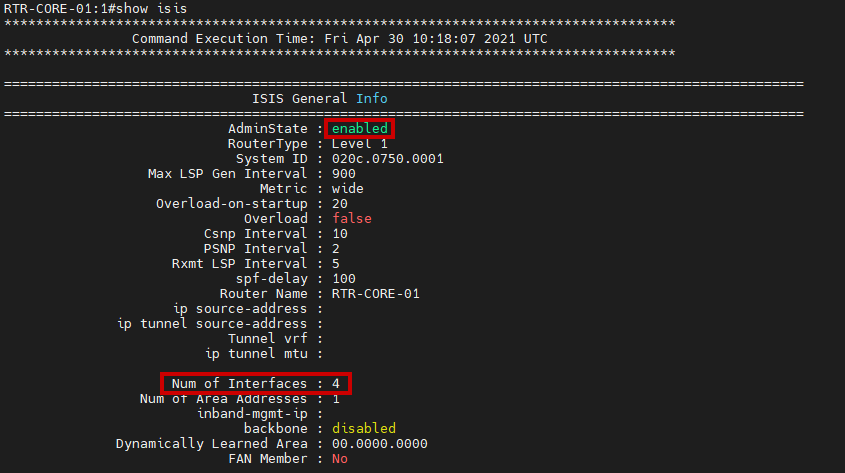
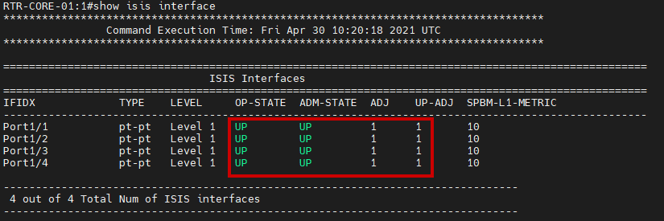
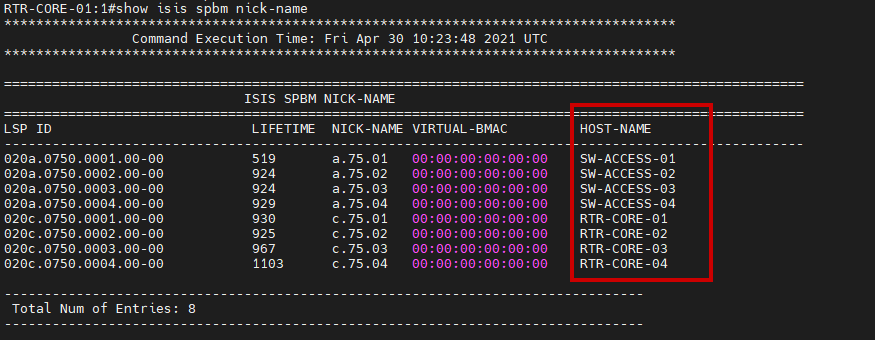
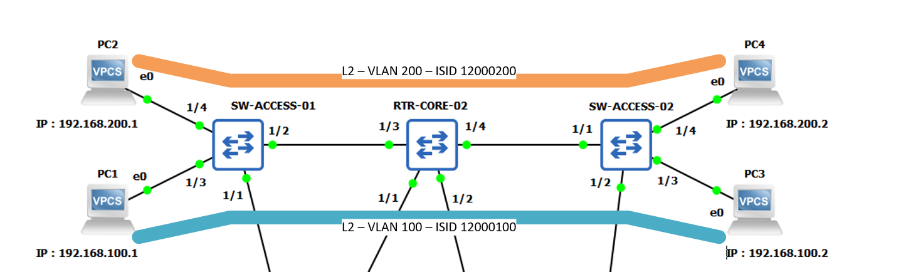

[](https://github.com/tchevalleraud/how-to-build-extreme-spb-network-fabric)
---
[![Project Version](https://img.shields.io/badge/Project_version-1.0.0-lightgrey?logo=data:image/png;base64,iVBORw0KGgoAAAANSUhEUgAAAA4AAAAOCAYAAAAfSC3RAAAAGXRFWHRTb2Z0d2FyZQBBZG9iZSBJbWFnZVJlYWR5ccllPAAAAyJpVFh0WE1MOmNvbS5hZG9iZS54bXAAAAAAADw/eHBhY2tldCBiZWdpbj0i77u/IiBpZD0iVzVNME1wQ2VoaUh6cmVTek5UY3prYzlkIj8+IDx4OnhtcG1ldGEgeG1sbnM6eD0iYWRvYmU6bnM6bWV0YS8iIHg6eG1wdGs9IkFkb2JlIFhNUCBDb3JlIDUuMy1jMDExIDY2LjE0NTY2MSwgMjAxMi8wMi8wNi0xNDo1NjoyNyAgICAgICAgIj4gPHJkZjpSREYgeG1sbnM6cmRmPSJodHRwOi8vd3d3LnczLm9yZy8xOTk5LzAyLzIyLXJkZi1zeW50YXgtbnMjIj4gPHJkZjpEZXNjcmlwdGlvbiByZGY6YWJvdXQ9IiIgeG1sbnM6eG1wPSJodHRwOi8vbnMuYWRvYmUuY29tL3hhcC8xLjAvIiB4bWxuczp4bXBNTT0iaHR0cDovL25zLmFkb2JlLmNvbS94YXAvMS4wL21tLyIgeG1sbnM6c3RSZWY9Imh0dHA6Ly9ucy5hZG9iZS5jb20veGFwLzEuMC9zVHlwZS9SZXNvdXJjZVJlZiMiIHhtcDpDcmVhdG9yVG9vbD0iQWRvYmUgUGhvdG9zaG9wIENTNiAoV2luZG93cykiIHhtcE1NOkluc3RhbmNlSUQ9InhtcC5paWQ6MkQzQ0Y2Mjg3QUIxMTFFQUFDMDJEQzA0MjdFMzQ3MkYiIHhtcE1NOkRvY3VtZW50SUQ9InhtcC5kaWQ6MkQzQ0Y2Mjk3QUIxMTFFQUFDMDJEQzA0MjdFMzQ3MkYiPiA8eG1wTU06RGVyaXZlZEZyb20gc3RSZWY6aW5zdGFuY2VJRD0ieG1wLmlpZDoyRDNDRjYyNjdBQjExMUVBQUMwMkRDMDQyN0UzNDcyRiIgc3RSZWY6ZG9jdW1lbnRJRD0ieG1wLmRpZDoyRDNDRjYyNzdBQjExMUVBQUMwMkRDMDQyN0UzNDcyRiIvPiA8L3JkZjpEZXNjcmlwdGlvbj4gPC9yZGY6UkRGPiA8L3g6eG1wbWV0YT4gPD94cGFja2V0IGVuZD0iciI/Puwy1SsAAAEfSURBVHjahNKxSgNBEMbx3IkQUGMnVhKNktoUFqIISpoUEkiVKp2VbyCIjQi22lhaKfgMYqdWokgIkgTxFcRYBHT9D3yn42HiwA/2dmeW3dmLQgiZVMRYxAIitHGHz19ZVuhUcY1++Akb36Lmc33RXvg/9tOFdS1c4AAveBAbH+JcOY2kcAJdTW5rozF3kmS8pRzbaNIasY45Xf5JV++5NiRja9IHZlC2wpIWnnGZGRxX6GhcssKsPkbU/kERKcciG7td8lgeUriE2e9jc9E8emiipfeads2Zwibaas47CsniMR71Traw4wp3U2955N9xHPc405sWXGHDFd0gZ/OxzvyGNbX7BBvubqOaP0UFr3/9q2YVRfc9j5V03pcAAwBVVJdvQk617QAAAABJRU5ErkJggg==&style=flat)](https://github.com/tchevalleraud/how-to-build-extreme-spb-network-fabric) [![VSP Version](https://img.shields.io/badge/vVOSS-8.3-blueviolet?logo=data:image/png;base64,iVBORw0KGgoAAAANSUhEUgAAAA4AAAAOCAYAAAAfSC3RAAAAGXRFWHRTb2Z0d2FyZQBBZG9iZSBJbWFnZVJlYWR5ccllPAAAAyJpVFh0WE1MOmNvbS5hZG9iZS54bXAAAAAAADw/eHBhY2tldCBiZWdpbj0i77u/IiBpZD0iVzVNME1wQ2VoaUh6cmVTek5UY3prYzlkIj8+IDx4OnhtcG1ldGEgeG1sbnM6eD0iYWRvYmU6bnM6bWV0YS8iIHg6eG1wdGs9IkFkb2JlIFhNUCBDb3JlIDUuMy1jMDExIDY2LjE0NTY2MSwgMjAxMi8wMi8wNi0xNDo1NjoyNyAgICAgICAgIj4gPHJkZjpSREYgeG1sbnM6cmRmPSJodHRwOi8vd3d3LnczLm9yZy8xOTk5LzAyLzIyLXJkZi1zeW50YXgtbnMjIj4gPHJkZjpEZXNjcmlwdGlvbiByZGY6YWJvdXQ9IiIgeG1sbnM6eG1wPSJodHRwOi8vbnMuYWRvYmUuY29tL3hhcC8xLjAvIiB4bWxuczp4bXBNTT0iaHR0cDovL25zLmFkb2JlLmNvbS94YXAvMS4wL21tLyIgeG1sbnM6c3RSZWY9Imh0dHA6Ly9ucy5hZG9iZS5jb20veGFwLzEuMC9zVHlwZS9SZXNvdXJjZVJlZiMiIHhtcDpDcmVhdG9yVG9vbD0iQWRvYmUgUGhvdG9zaG9wIENTNiAoV2luZG93cykiIHhtcE1NOkluc3RhbmNlSUQ9InhtcC5paWQ6ODM4Q0MyQTQ3QUIwMTFFQTg2REFFNEY5NEFGNDlBODIiIHhtcE1NOkRvY3VtZW50SUQ9InhtcC5kaWQ6ODM4Q0MyQTU3QUIwMTFFQTg2REFFNEY5NEFGNDlBODIiPiA8eG1wTU06RGVyaXZlZEZyb20gc3RSZWY6aW5zdGFuY2VJRD0ieG1wLmlpZDo4MzhDQzJBMjdBQjAxMUVBODZEQUU0Rjk0QUY0OUE4MiIgc3RSZWY6ZG9jdW1lbnRJRD0ieG1wLmRpZDo4MzhDQzJBMzdBQjAxMUVBODZEQUU0Rjk0QUY0OUE4MiIvPiA8L3JkZjpEZXNjcmlwdGlvbj4gPC9yZGY6UkRGPiA8L3g6eG1wbWV0YT4gPD94cGFja2V0IGVuZD0iciI/Pk5d9KkAAAC+SURBVHjaYvz//z8DGYCJEarRDYgrgJiQKYxA3A/ER1mgArJA7EikbauB+B1M4x8o/RWIZwPxLzw2ngIxWNAkPgBxITHWsmAxkQeIvwCxJpQNA9+B+Ao+jbAAWgDEZkhy14FYGybPBBWEKeZAUvgbzdDf2JwKM2Au1EkgEAvEXEhqf6BEFygegTgdiPuhbKIwLAGA3J4JdcF/AgkA5PcTyKYk/icOZIHUI4fqfCB+D8QJBGy8AWaQmcgZAAIMAPmGiMhVj17uAAAAAElFTkSuQmCC&style=flat)](https://github.com/extremenetworks/Virtual_VOSS) [![GNS3 Version](https://img.shields.io/badge/GNS3-2.2.8-blue?logo=data:image/png;base64,iVBORw0KGgoAAAANSUhEUgAAAA4AAAAOCAYAAAAfSC3RAAAAGXRFWHRTb2Z0d2FyZQBBZG9iZSBJbWFnZVJlYWR5ccllPAAAAyJpVFh0WE1MOmNvbS5hZG9iZS54bXAAAAAAADw/eHBhY2tldCBiZWdpbj0i77u/IiBpZD0iVzVNME1wQ2VoaUh6cmVTek5UY3prYzlkIj8+IDx4OnhtcG1ldGEgeG1sbnM6eD0iYWRvYmU6bnM6bWV0YS8iIHg6eG1wdGs9IkFkb2JlIFhNUCBDb3JlIDUuMy1jMDExIDY2LjE0NTY2MSwgMjAxMi8wMi8wNi0xNDo1NjoyNyAgICAgICAgIj4gPHJkZjpSREYgeG1sbnM6cmRmPSJodHRwOi8vd3d3LnczLm9yZy8xOTk5LzAyLzIyLXJkZi1zeW50YXgtbnMjIj4gPHJkZjpEZXNjcmlwdGlvbiByZGY6YWJvdXQ9IiIgeG1sbnM6eG1wPSJodHRwOi8vbnMuYWRvYmUuY29tL3hhcC8xLjAvIiB4bWxuczp4bXBNTT0iaHR0cDovL25zLmFkb2JlLmNvbS94YXAvMS4wL21tLyIgeG1sbnM6c3RSZWY9Imh0dHA6Ly9ucy5hZG9iZS5jb20veGFwLzEuMC9zVHlwZS9SZXNvdXJjZVJlZiMiIHhtcDpDcmVhdG9yVG9vbD0iQWRvYmUgUGhvdG9zaG9wIENTNiAoV2luZG93cykiIHhtcE1NOkluc3RhbmNlSUQ9InhtcC5paWQ6QzkyMDFFMDg3QUIwMTFFQTlDRkI5MUVFMDU5RjMyQ0YiIHhtcE1NOkRvY3VtZW50SUQ9InhtcC5kaWQ6QzkyMDFFMDk3QUIwMTFFQTlDRkI5MUVFMDU5RjMyQ0YiPiA8eG1wTU06RGVyaXZlZEZyb20gc3RSZWY6aW5zdGFuY2VJRD0ieG1wLmlpZDpDOTIwMUUwNjdBQjAxMUVBOUNGQjkxRUUwNTlGMzJDRiIgc3RSZWY6ZG9jdW1lbnRJRD0ieG1wLmRpZDpDOTIwMUUwNzdBQjAxMUVBOUNGQjkxRUUwNTlGMzJDRiIvPiA8L3JkZjpEZXNjcmlwdGlvbj4gPC9yZGY6UkRGPiA8L3g6eG1wbWV0YT4gPD94cGFja2V0IGVuZD0iciI/Pqk2Mi4AAAErSURBVHjafNLNK0RRGMfxY7pC2UoUOy/JbkLKS5RmYYqFrJRSspKysLSwQUkpL/8D22myIRaUmhVFBuUlw2I2NoqF63unnzxOubc+3Xqe53fPveceF4ah+0crLrGHlN93McHx8O+1gpq4YAfWkEEaw3hU+BB1fjDABr40NKNwFaZUK2DaD256rzaLJvVWTX0wqpWV0s5149T9Xh8IsI4K9OAV95iP+oEGJ0zoFk94Rx+68IICikgh+xNsMcFr1GMZlUjiSg96wHk0lNBwwgSHkEcDepHBhepz6LSBGxNc1EoHWEAO7fjUtw+UprRr/WbXRtGME4yZXU9iG5P+79hRsKhTM4I29WqxhGNU+8FybJmV89jHGd50b4w7ctGB3sUdnnGk0xLYuW8BBgBFhMQo22FM+gAAAABJRU5ErkJggg==&style=flat)](https://github.com/GNS3/gns3-server)

---

# About this repository

This repository aims to show you how to set up a SPB fabric solution from the manufacturer Extreme networks.

This guide will cover the following topics:
- Implementation of ISIS and SPBm
- Establishment of a level 2 service
- Implementation of routing
- Implementation of VRF

# Implementation of the fabric

## Topology overview

[](https://github.com/tchevalleraud/how-to-build-extreme-spb-network-fabric)

## Basic configuration

### VSP Configuration

| Name         | MGMT Ip       | Area    |   System ID    | Instance | Nick-Name | B-VLAN    | Primary | File                                       |
| :----------- | :-----------: | :-----: | :------------: | :------: | :-------: | :-------: | :-----: | :----------------------------------------: |
| RTR-CORE-01  | 192.168.0.201 | 49.0001 | 020c.0750.0001 | 1        | c.75.01   | 4051,4052 | 4051    | [config.cfg](config/LAB01/RTR-CORE-01.cfg) |
| RTR-CORE-02  | 192.168.0.202 | 49.0001 | 020c.0750.0002 | 1        | c.75.02   | 4051,4052 | 4051    | [config.cfg](config/LAB01/vVOSS2.cfg) |
| RTR-CORE-03  | 192.168.0.203 | 49.0001 | 020c.0750.0003 | 1        | c.75.03   | 4051,4052 | 4051    | [config.cfg](config/LAB01/vVOSS3.cfg) |
| RTR-CORE-04  | 192.168.0.204 | 49.0001 | 020c.0750.0004 | 1        | c.75.04   | 4051,4052 | 4051    | [config.cfg](config/LAB01/vVOSS4.cfg) |
| SW-ACCESS-01 | 192.168.0.205 | 49.0001 | 020a.0750.0001 | 1        | a.75.01   | 4051,4052 | 4051    | [config.cfg](config/LAB01/vVOSS5.cfg) |
| SW-ACCESS-02 | 192.168.0.206 | 49.0001 | 020a.0750.0002 | 1        | a.75.01   | 4051,4052 | 4051    | [config.cfg](config/LAB01/vVOSS6.cfg) |
| SW-ACCESS-03 | 192.168.0.207 | 49.0001 | 020a.0750.0003 | 1        | a.75.01   | 4051,4052 | 4051    | [config.cfg](config/LAB01/vVOSS7.cfg) |
| SW-ACCESS-04 | 192.168.0.208 | 49.0001 | 020a.0750.0004 | 1        | a.75.01   | 4051,4052 | 4051    | [config.cfg](config/LAB01/vVOSS8.cfg) |

### Template configuration

``` properties
RTR-CORE-01(config)# enable
RTR-CORE-01(config)# configuration terminal
RTR-CORE-01(config)# sys name <name>
RTR-CORE-01(config)# spbm
RTR-CORE-01(config)# router isis
RTR-CORE-01(config)# system-id <system_id>
RTR-CORE-01(config)# manual-area <area>
RTR-CORE-01(config)# spbm <spbm_instance>
RTR-CORE-01(config)# spbm <spbm_instance> nick-name <nick-name>
RTR-CORE-01(config)# spbm <spbm_instance> b-vid <b-vlan> primary <primary>
RTR-CORE-01(config)# exit
RTR-CORE-01(config)# vlan create <b-vlan1> name BVLAN1 type spbm-bvlan
RTR-CORE-01(config)# vlan create <b-vlan2> name BVLAN2 type spbm-bvlan
RTR-CORE-01(config)# router isis enable
```

### Configuration example for ```RTR-CORE-01```

``` properties
RTR-CORE-01(config)# enable
RTR-CORE-01(config)# configuration terminal
RTR-CORE-01(config)# sys name RTR-CORE-01
RTR-CORE-01(config)# spbm
RTR-CORE-01(config)# router isis
RTR-CORE-01(config)# system-id 020c.0750.0001
RTR-CORE-01(config)# manual-area 49.0001
RTR-CORE-01(config)# spbm 1
RTR-CORE-01(config)# spbm 1 nick-name c.75.01
RTR-CORE-01(config)# spbm 1 b-vid 4051,4052 primary 4051
RTR-CORE-01(config)# exit
RTR-CORE-01(config)# vlan create 4051 name BVLAN1 type spbm-bvlan
RTR-CORE-01(config)# vlan create 4052 name BVLAN2 type spbm-bvlan
RTR-CORE-01(config)# router isis enable
```

## NNI Interface configuration

### Template configuration

``` properties
RTR-CORE-01(config)# interface gigabitEthernet <interface>
RTR-CORE-01(config)# isis
RTR-CORE-01(config)# isis spbm <spbm_instance>
RTR-CORE-01(config)# isis enable
RTR-CORE-01(config)# no spanning-tree mstp force-port-state enable
RTR-CORE-01(config)# y
RTR-CORE-01(config)# no shutdown
RTR-CORE-01(config)# exit
```

### Configuration example for ```RTR-CORE-01```

``` properties
RTR-CORE-01(config)# interface gigabitEthernet 1/1
RTR-CORE-01(config)# isis
RTR-CORE-01(config)# isis spbm 1
RTR-CORE-01(config)# isis enable
RTR-CORE-01(config)# no spanning-tree mstp force-port-state enable
RTR-CORE-01(config)# y
RTR-CORE-01(config)# no shutdown
RTR-CORE-01(config)# exit
```

## How to control configuration

It is possible to have several level of troubleshooting

The following commands are used to check the correct configuration on the equipment :

``` properties
RTR-CORE-01(config)# show isis
```

[](https://github.com/tchevalleraud/how-to-build-extreme-spb-network-fabric)

``` properties
RTR-CORE-01(config)# show isis interface
```

[](https://github.com/tchevalleraud/how-to-build-extreme-spb-network-fabric)

But it is also possible to have a set of information on the other members of the fabric, it is enough to execute the following commands from any equipment :

``` properties
RTR-CORE-01(config)# show isis spbm nick-name
```

[](https://github.com/tchevalleraud/how-to-build-extreme-spb-network-fabric)

# Establishment of a level 2 service

## Topology overview

[](https://github.com/tchevalleraud/how-to-build-extreme-spb-network-fabric)

## Basic configuration

| vPC | VLAN | I-SID    | IP | Instance    |
| :-- | :--: | :------: | :--------------: |
| PC1 | 100  | 12000100 | 192.168.100.1/24 |

## UNI Interface configuration

# Implementation of routing

## Topology overview

## Basic configuration

# Implementation of VRF

## Topology overview

## Basic configuration
